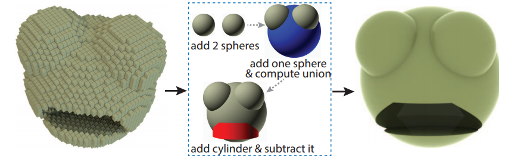

# CSGNet: Neural Shape Parser for Constructive Solid Geometry
This repository contains code accompanying the paper: [CSGNet: Neural Shape Parser for Constructive Solid Geometry, CVPR 2018](https://arxiv.org/abs/1712.08290).

This code base contains model architecture and dataset for 3D-CSGNet. For 2D-CSGNet, look at this [repository](https://github.com/Hippogriff/CSGNet).




### Dependency
- Python >3.5*
- Please use conda env using environment.yml file.
  ```bash
  conda env create -f environment.yml -n 3DCSGNet
  source activate 3DCSGNet
  ```

### Data
- Synthetic Dataset:

    Download the synthetic [dataset](https://www.dropbox.com/s/kq7ackfn6uo6ml8/data.tar.gz) and un-tar it in the root. Pre-trained model is available [here](https://www.dropbox.com/s/71lft3dwdr2xfvi/models.tar.gz?dl=0), untar it in the directory `trained_models/`. Synthetic dataset is provided in the form of program expressions, instead of rendered images. Images for training, validation and testing are rendered on the fly. The dataset is split in different program lengths.
    ```bash
    tar -zxvf data.tar.gz
    ```

- How to create **Voxels** from program expressions?

    Start by loading some program expression from data/x_ops/expressions.txt files. You can get voxels in the form of Numpy array using the following:
    ```python
    import deepdish as dd
    from src.Utils.train_utils import voxels_from_expressions

    # pre-rendered shape primitives in the form of voxels for better performance
    primitives = dd.io.load("data/primitives.h5")
    expressions = ["cy(48,48,32,8,12)cu(24,24,40,28)+", "sp(48,32,32,8,12)cu(24,24,40,28)+"]

    voxels = voxels_from_expressions(expressions, primitives, max_len=7)
    print(voxels.shape)

    (2, 64, 64, 64)
    ```

    In case of key error in the above, or if you want to execute programs of higher length or arbitary positions and scales, then change the `max_len=len_of_program` and `primitives=None` in the above method. However, this will render primitives on-the-fly and will be slow.

### Supervised Learning
- To train, update `config.yml` with required arguments. Also make sure to fill up the config.yml file with proportion of the dataset that you want to train on (default is 1 percent, can go up to 100 percent which is used in the paper). Then run:
    ```python
    python train.py
    ```

- To test, update `config.yml` with required arguments. Specify the path of pre-trained model in the config file on the field `pretrain_model_path=trained_models/models.pth`,  `preload_model=True` and `proportion=100`. Then run:
    ```python
    # For top-1 testing
    python test.py
    ```

    ```python
    # For beam-search-k testing
    python test_beam_search.py
    ```

### Cite:
```bibtex
@InProceedings{Sharma_2018_CVPR,
author = {Sharma, Gopal and Goyal, Rishabh and Liu, Difan and Kalogerakis, Evangelos and Maji, Subhransu},
title = {CSGNet: Neural Shape Parser for Constructive Solid Geometry},
booktitle = {The IEEE Conference on Computer Vision and Pattern Recognition (CVPR)},
month = {June},
year = {2018}
}
```


### Contact

To ask questions, please [email](mailto:gopalsharma@cs.umass.edu).
